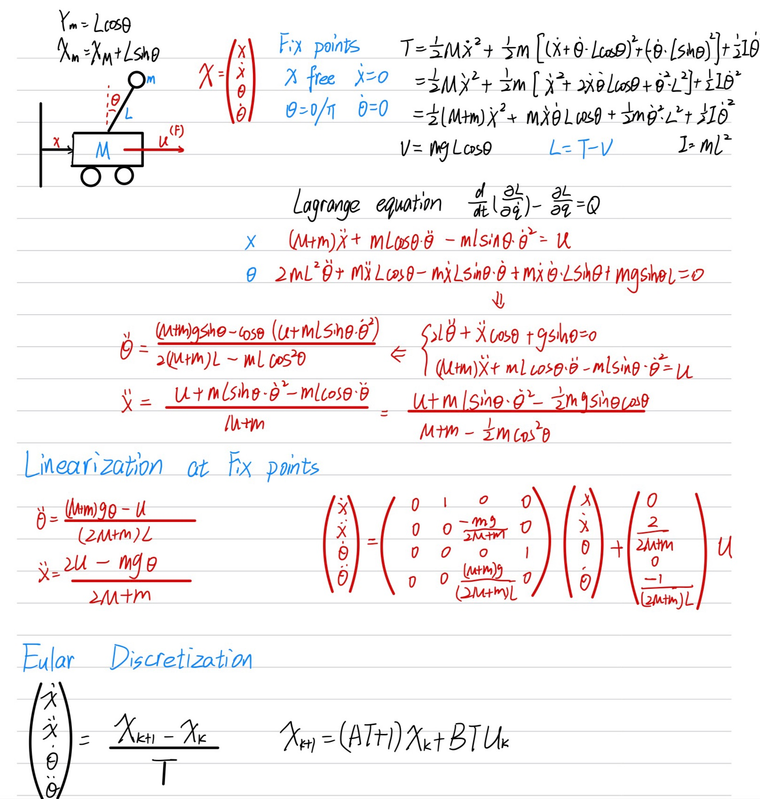
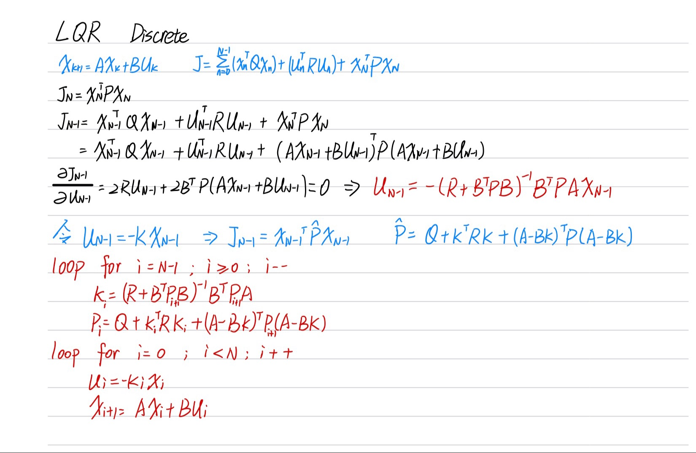

# Optimal-Control-example

Several Optimal control examples with python and matlab including modeling and control

with Book http://databookuw.com/databook.pdf

build several model based on gym

## Invert Pendulum on a Cart

#### Build model based on gym cartpole and make several changes:

- make separated action to continuous torque
- make mass of the pendulum mainly to the ball attached to the pendulum.

## Controller

#### Linear–quadratic regulator

2D Linear Pendulum Walking
